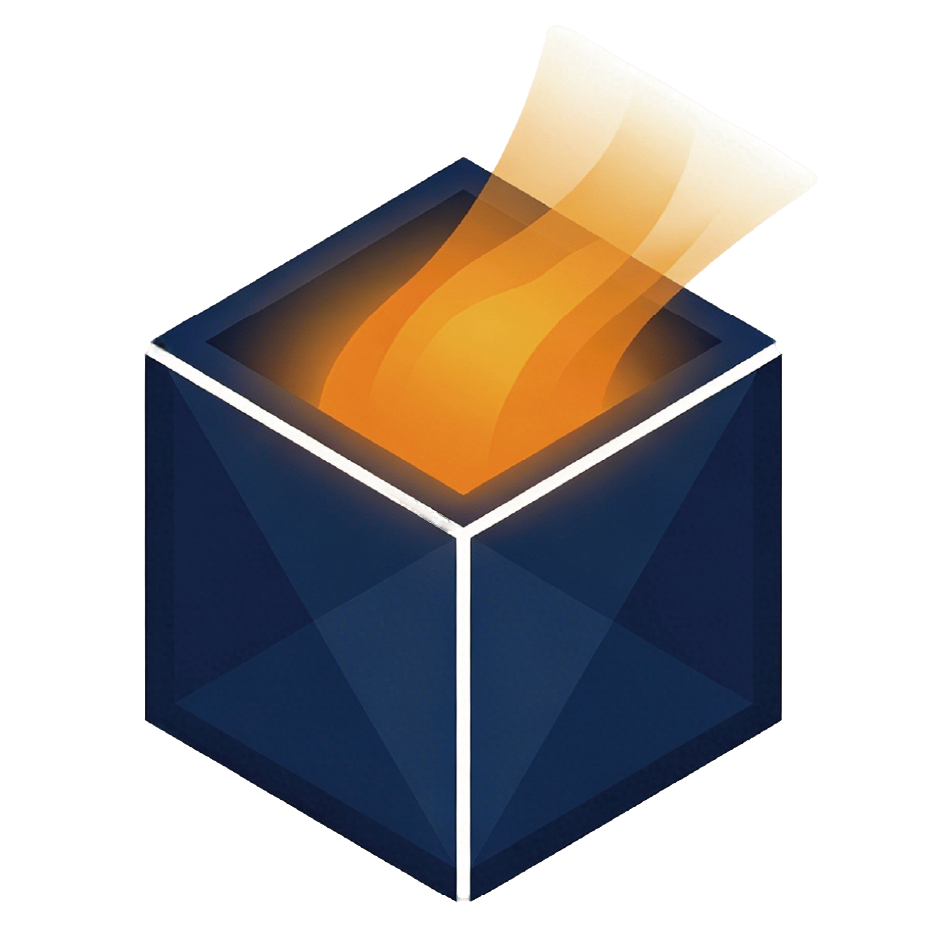
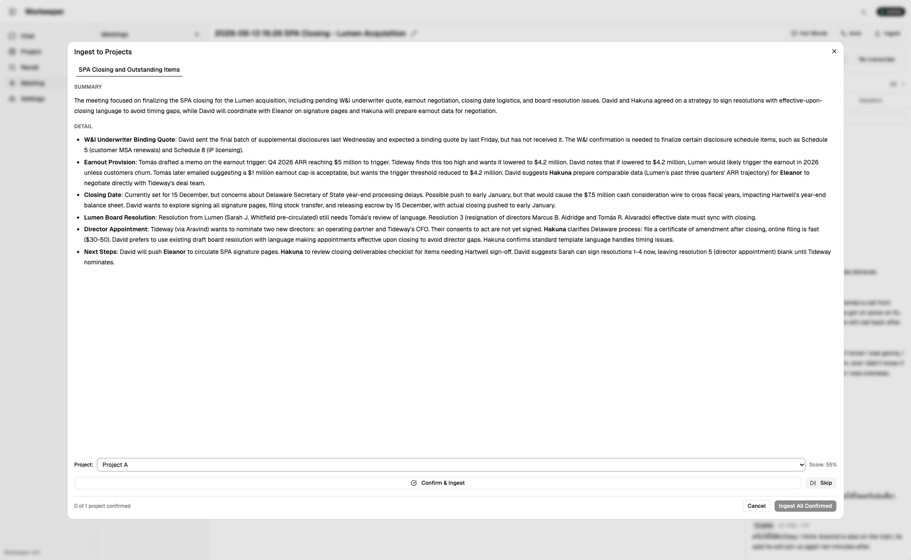
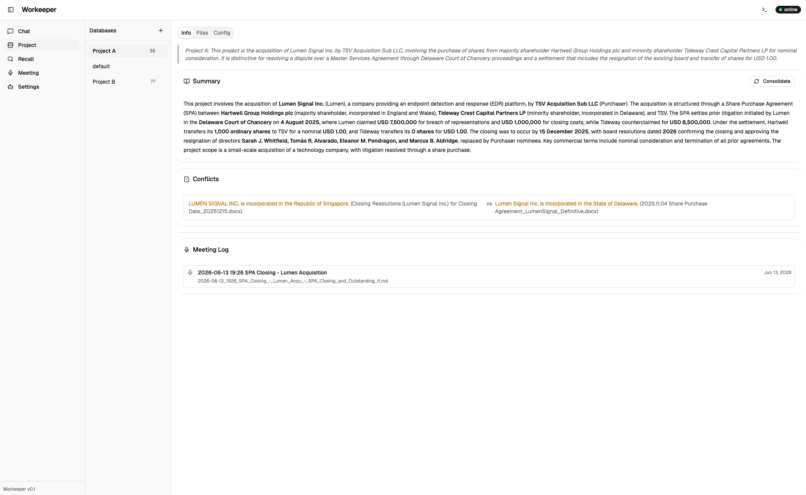
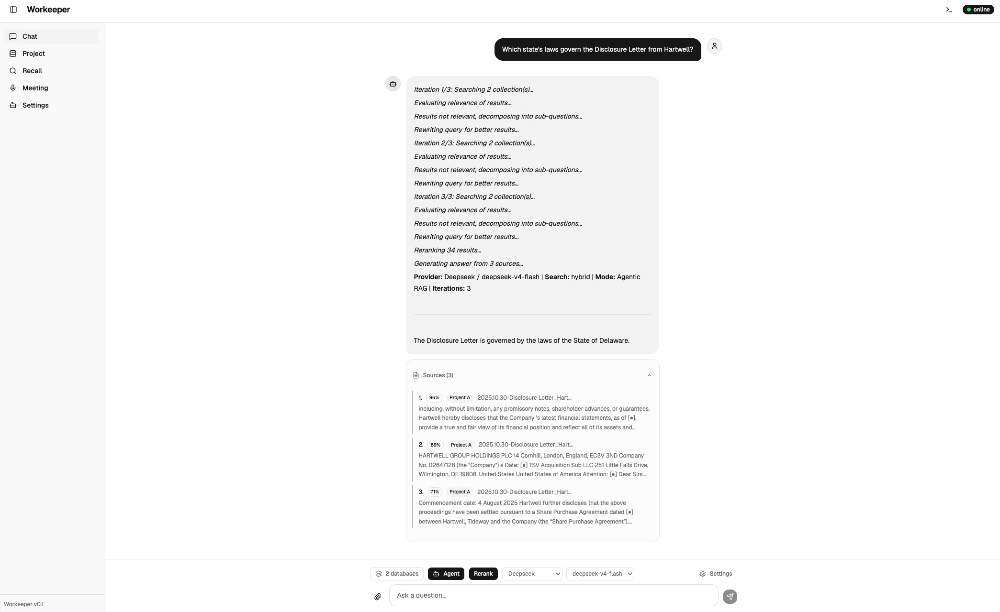
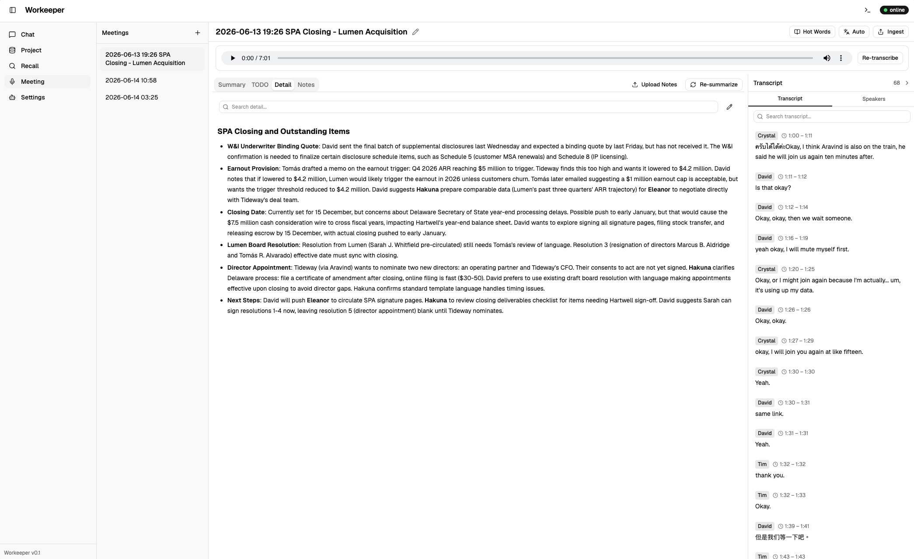
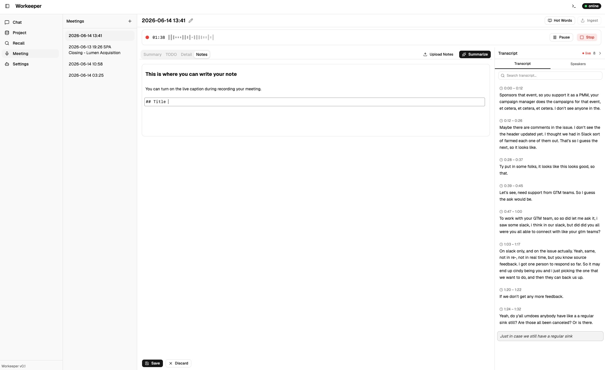
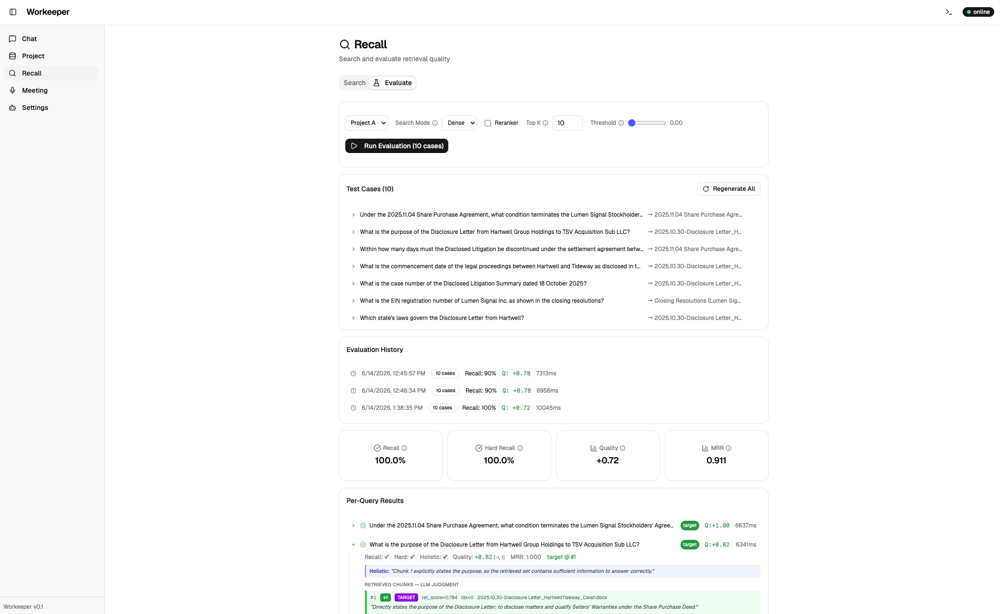
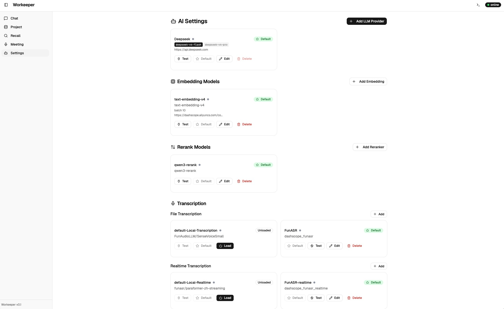

# Workeeper

<p align="center"></p>

[English](https://github.com/superdd-coder/workeeper)

为项目管理人员打造的知识库与会议记忆系统。导入项目文档、转录会议、与项目数据和会议纪要对话 — 一切自动整理、总结、可检索。

> *注意：截图中展示的项目数据均为 AI 生成的演示信息。*

## 快速开始

**前提**: 已安装 Docker

```bash
git clone https://github.com/superdd-coder/workeeper.git
cd workeeper

# 可选：自定义端口
cp .env.template .env

# 构建并启动
docker compose up -d --build
```

打开 [http://localhost:18900](http://localhost:18900)。首次启动：
1. 下载你需要的本地转录模型
2. 进入 **Settings** → 添加 **LLM provider**（支持任何 OpenAI 兼容 API）
3. 添加 **Embedding provider**，创建项目数据库

### 更新

```bash
git pull
docker compose up -d --build
```

Docker 会用最新代码重建镜像，同时保留 `data/` 目录（数据库、配置、历史记录）。

### 一键配置 DashScope API

如果你使用 [DashScope（阿里云百炼）](https://bailian.console.aliyun.com/)，可以一次性配置所有服务 — LLM、Embedding、Reranker、文件转写、实时转写。进入 **Settings** → **LLM Providers** 标签 → 点击 **OneShot Setting (DashScope API)**，输入 DashScope API Key，各项服务即按默认值创建：

| 服务 | 默认模型 |
|------|----------|
| LLM | deepseek-v4-flash |
| Embedding | text-embedding-v4 |
| Reranker | qwen3-rerank |
| 文件转写 | fun-asr |
| 实时转写 | fun-asr-realtime |

可在对话框中修改任意模型名称后一键应用。配置完成后可单独调整各服务或切换默认值。

## 工作流程

Workeeper 将会议和文档连接成统一的项目记忆。

### 会议 → 数据库流转

转录完会议后，Workeeper 会捕获全部内容：带说话人识别的转写文本、自动生成的要旨/摘要/待办事项、会议笔记。一键即可将会议内容分配到项目数据库：



会议转写、总结和笔记变为项目集合中可检索的文档。支持批量导入多个会议，将不同会议内容映射到对应的项目版块。

### 项目数据库

每个项目拥有独立的集合，可配置独立的切片和嵌入策略。上传合同、提案、表格等文件——系统自动解析、切片、上下文充实、索引。



**自动摘要**: 每份文档生成结构化摘要（数据点、事实、洞察）。集合级别有整合概览，文档矛盾时自动检测冲突。

### AI 对话

跨集合与项目数据对话。Agentic RAG 管道处理查询分析、多集合检索、重排序和迭代优化——全部流式响应。



## 功能

### 会议转录



- **文件转录** — 上传录音离线转写，自动识别说话人
- **实时转录** — WebSocket 流式转写，适用于实时会议
- **本地模型** — FunASR SenseVoiceSmall 完全离线运行，无需云端
- **云端提供商** — 支持 DashScope FunASR 和 OpenAI 兼容 API
- **自动生成摘要** — LLM 提取要旨、摘要、待办事项
- **会议笔记** — 结构化的会议文档
- **热词库** — 自定义领域词汇，提高转写准确率



### RAG 管道

- **Agentic RAG** — 分析 → 路由 → 检索 → 评分 → 分解 → 重排 → 合成
- **混合搜索** — 稠密向量 + 稀疏 BM25，基于 Qdrant
- **流式响应** — SSE 实时对话输出
- **重排序** — 支持 Cohere、Qwen 或本地模型
- **召回评估** — 内置基准测试工具，参数可调



### 平台

- **Provider 体系** — 可插拔的 LLM / Embedding / Reranker / 转录后端
- **OpenAI 兼容** — 支持 OpenAI、DeepSeek、Qwen、Ollama、vLLM、LM Studio 等
- **零配置** — 全部设置通过 Web 界面管理，无需手动编辑 YAML
- **MCP 服务** — 将 RAG 能力暴露为 AI Agent 工具
- **任务队列** — 异步文档处理，全局 LLM 并发控制



## 架构

```
frontend/          React 19 + Vite + Tailwind CSS + Shadcn UI
src/
  api/             FastAPI 路由
  db/              Qdrant 客户端
  mcp/             MCP 服务器
  parsers/         12 种格式解析器
  providers/       LLM、Embedding、Reranker、转录
  rag/             切片器、检索器、Agent、重排序、摘要管理
  meeting/         会议模型、转录、路由
  hot_words/       词汇库管理
  tasks/           异步任务队列（含并发控制）
data/              运行时数据（gitignored）
```

## 推荐配置

项目针对[阿里云百炼平台](https://bailian.console.aliyun.com/)进行了优化适配：

- **转录** — 百炼 FunASR（专项优化适配）
- **Reranker** — 通过百炼 API 使用 Qwen3-Reranker

推荐使用百炼 API 进行配置，以获得最佳开箱即用体验。后续如有需要将增加更多的 Provider 适配。

## 配置

全部通过 **Settings** 页面管理，无需手动编辑配置文件。

- **LLM** — 任意 OpenAI 兼容端点，可配置 `max_concurrent_requests` 控制并发
- **Embedding** — 远端 API（自动探测维度）或本地 sentence-transformers
- **Reranker** — Cohere、Qwen DashScope 或本地模型
- **转录** — 设备选择（CPU/GPU），云端 API 密钥

API 密钥存储在 `data/config.yaml`（gitignored，不会提交）。

## API

| 端点 | 描述 |
|----------|-------------|
| `/api/query` | 对话（SSE 流式） |
| `/api/documents` | 文档上传、解析、列表、删除 |
| `/api/collections` | 集合增删改查 |
| `/api/config` | Provider 与设置管理 |
| `/api/recall` | 召回评估与基准测试 |
| `/api/info` | 摘要、冲突、项目描述 |
| `/api/meetings` | 会议增删改查、转录、笔记 |
| `/hot-words` | 词汇库管理 |

`GET /health → {"status": "ok"}`

## MCP 服务

Workeeper 内置 [MCP (Model Context Protocol)](https://modelcontextprotocol.io/) 服务器，将完整的 RAG 管道以工具形式暴露给 AI 编程助手。配合 Claude Code、Cursor 或任何兼容 MCP 的客户端使用，可直接在 IDE 中查询知识库。

### 快速配置 (Claude Code)

将以下内容添加到 Claude Code 的 MCP 设置中（`~/.claude/settings.json` 或项目级 `.claude/settings.json`）：

```json
{
  "mcpServers": {
    "workeeper": {
      "command": "python",
      "args": ["-m", "src.mcp.server"],
      "cwd": "/path/to/workeeper"
    }
  }
}
```

MCP 服务使用 **stdio** 传输 — Claude Code 以子进程方式启动，通过 stdin/stdout 通信，无需端口。

### 可用工具

| 工具 | 描述 |
|------|-------------|
| **`list_collections`** | 列出所有知识库及其文档片段数 |
| **`create_collection`** | 创建新集合（合理默认值） |
| **`get_collection_config`** | 获取集合完整配置 |
| **`update_collection_config`** | 更新集合配置（部分更新） |
| **`delete_collection`** | 删除集合及其所有文档 |
| **`list_documents`** | 列出集合中的文档 |
| **`upload_document`** | 上传文档进行异步索引 |
| **`upload_folder`** | 从服务器目录批量导入文档 |
| **`delete_document`** | 删除文档及其所有片段 |
| **`get_task_status`** | 查询异步任务进度 |
| **`rag_query`** | 提问 — Agentic RAG 生成带来源引用的回答 |
| **`search_chunks`** | 原始片段检索，带相关性分数 |
| **`get_query_history`** | 获取历史查询记录 |
| **`get_collection_summary`** | LLM 生成的集合概览 |
| **`get_project_description`** | 集合的简短描述 |
| **`get_doc_summary`** | 文档的结构化摘要 |
| **`get_conflicts`** | 检测文档间的矛盾信息 |
| **`trigger_consolidate`** | 重建集合级别的摘要 |

## 环境变量

全部可选。复制 `.env.template` 为 `.env`：

| 变量 | 默认值 | 描述 |
|----------|---------|-------------|
| `API_PORT` | `18900` | 后端端口 |
| `UI_PORT` | `5173` | Vite 开发服务器端口 |
| `QDRANT_HTTP_PORT` | `6343` | Qdrant HTTP |
| `QDRANT_GRPC_PORT` | `6334` | Qdrant gRPC |

## 技术栈

Python 3.11+, FastAPI, React 19, Vite, TypeScript, Tailwind CSS, Qdrant, FunASR, Zustand

## 许可

MIT — 详见 [LICENSE](LICENSE)。
